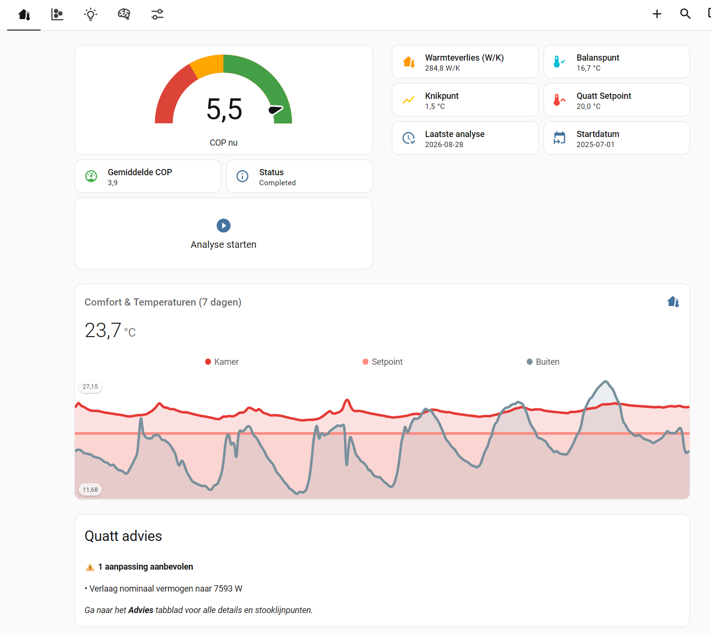
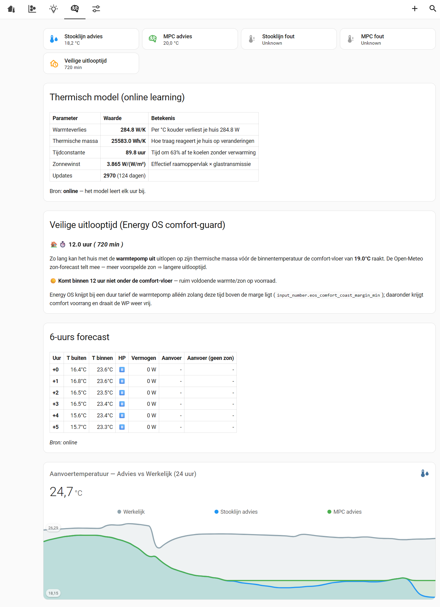

# Quatt Warmteanalyse

<p align="center">
  
</p>

Home Assistant custom integration for analyzing your Quatt heat pump performance. It measures
what your house actually needs — heat loss, balance point, the temperature where the gas
boiler has to assist — and turns that into concrete settings you can ask Quatt to change.
Optionally compares against your gas consumption from before the heat pump.

Everything it does is read-only by default: it advises, it does not steer your installation.



*The Overzicht tab: current COP, your home's measured heat loss and balance point, the knee
temperature where the boiler has to assist, and the concrete change to ask Quatt for.*

## Terminology

The analysis uses the Dutch terms your installer and Quatt support use, so you can repeat
them verbatim when you ask for a change. Dutch and English are used interchangeably below.

| Term | Meaning |
|------|---------|
| **Stooklijn** | Heating curve — the relation between outdoor temperature and the supply temperature the heat pump aims for. Flatter is usually more efficient. |
| **Aanvoertemperatuur** | Supply temperature — water leaving the heat pump towards your radiators or floor. |
| **Retourtemperatuur** | Return temperature — water coming back. |
| **Stookgrens** | Heating limit — the outdoor temperature above which no heating is needed. Called *balance point* in the English parts of this README. |
| **Knikpunt** | Knee temperature — the outdoor temperature below which the heat pump alone can no longer keep up and the gas boiler must assist. |
| **Nominaal vermogen** | Rated power — the heat output Quatt assumes your house needs at −10 °C. |
| **Warmtevraag** | Heat demand — how much power (W) your house currently needs. |

## Features

- **Heating curve analysis** — Calculates the optimal stooklijn based on actual heat pump data and compares it with Quatt's estimated curve
- **Heat loss coefficient** — Determines your home's heat loss in W/K using linear regression
- **COP tracking** — Average coefficient of performance and per-temperature scatter data
- **Knee temperature** — Detects the outdoor temperature where supplemental heating (boiler) kicks in
- **Gas comparison** (optional) — Compare heat pump performance with historical gas consumption from before installation
- **MPC shadow sensor** — Calculates an optimal supply temperature advice based on a 6-hour weather forecast, without touching your system
- **Online thermisch model** — Learns your home's thermal characteristics (heat loss W/K, thermal mass Wh/K, solar gain) in real-time using Recursive Least Squares; improves MPC accuracy continuously
- **Quatt advies** — Shows exactly which parameters to ask Quatt to adjust (stookgrens, nominaal vermogen, stooklijn breakpoints)
- **Geluidsniveaucompensatie** (optional) — Automatically adjusts the compressor sound level based on MPC error and boiler activity, with separate day/night limits
- **OpenQuatt ready** — Output sensors with optimal heating curve breakpoints and balance point, ready for OpenQuatt automations
- **Power House feedforward** — Publishes the measured house heat demand (W) for OpenQuatt's external heat demand input
- **Source abstraction** — Every measurement is exposed through a mirror sensor with a stable entity ID. Dashboards and automations keep working while the underlying source (Quatt, OpenQuatt, or your own sensor) switches or drops out
- **Runs without the cloud** — The Quatt Insights API is optional. With it off, the analysis continues on Home Assistant's own long-term statistics plus the integration's stored history
- **Dashboard included** — Pre-built Lovelace dashboard with five tabs, including a Systeem view showing which integration delivers each measurement

## Requirements

- Home Assistant 2024.1.0 or newer
- At least one source for the measurements — either works, and they can be mixed:
  - [Quatt integration](https://github.com/marcoboers/home-assistant-quatt) (local polling of the CIC), and/or
  - [OpenQuatt](https://github.com/OpenQuatt/OpenQuatt) (ESPHome firmware reading the heat pump locally)
- A Quatt account is **not** required. The Quatt Insights cloud API only adds hourly detail and can be switched off entirely
- [apexcharts-card](https://github.com/RomRider/apexcharts-card) (HACS frontend) for the dashboard charts
- [mini-graph-card](https://github.com/kalkih/mini-graph-card) (HACS frontend) for the historical trend charts

## Installation

### HACS (recommended)

1. Open HACS in Home Assistant
2. Go to **Integrations** > **Custom repositories**
3. Add `https://github.com/Appesteijn/stooklijn` and select **Integration** as category
4. Search for "Quatt Warmteanalyse" and install
5. Restart Home Assistant

### Manual

1. Copy the `custom_components/quatt_stooklijn` folder to your Home Assistant `config/custom_components/` directory
2. Restart Home Assistant

## Configuration

1. Go to **Settings** > **Devices & Services** > **Add Integration**
2. Search for "Quatt Warmteanalyse"
3. Follow the setup wizard:

### Step 1: Heat pump data
- **Start/end date** — The period to analyze (after heat pump installation)
- **Outside temperature sensor(s)** — Entity picker; add several and the first available one is used, the rest fill gaps
- **Power sensor** — Entity for total heat pump power

Leave a field empty and auto-detection picks the entity at runtime. That is usually the better choice: entity IDs differ per Quatt installation (see the v2→v3 device migration), so a value that is right today can be wrong after an update.

### Step 2: Gas analysis (optional)
- **Gas entity** — Cumulative gas meter (m³)
- **Gas period** — Date range from *before* heat pump installation
- **Calorific value** — Gas energy content (default: 9.77 kWh/m³ for Dutch gas)
- **Boiler efficiency** — Your old boiler's efficiency (default: 0.90)
- **Hot water threshold** — Temperature above which gas usage is counted as hot water only (default: 18°C)

### Step 3: Geluidsniveaucompensatie (optional)
- Enable the sound level compensation switch and configure day/night maximum levels and the day/night start times

## Data sources

The integration does not read sensors directly. It resolves eleven logical **roles** — supply temp, return temp, outside temp, room temp, control setpoint, room setpoint, flow rate, total power, power input, boiler heat, COP — and each role is filled by the first candidate that actually delivers a number.

### Candidate order

```
your configured entity  →  Quatt integration  →  OpenQuatt  →  known fallback names
```

Quatt deliberately comes before OpenQuatt so existing installations keep exactly the same primary source after an update. A configured entity always wins, which is the only way to override that order.

If the active source stops delivering — `unavailable`, `unknown`, or a non-numeric state — the next candidate takes over automatically, and it switches back as soon as the preferred source recovers.

### Choosing sources yourself

Every one of the eleven roles has its own field in **Configure**. Leave it empty for auto-detection, or point it at any sensor you like — including one that belongs to neither integration. Set the outside temperature to your own weather station and the analysis will use it.

### Mirror sensors

Each role is also published as a `sensor.quatt_warmteanalyse_*` mirror with a fixed entity ID. Dashboards and automations should use these rather than the raw sensors: the mirror keeps one continuous history while the source underneath switches. Its attributes name the entity and integration currently delivering.

`sensor.quatt_warmteanalyse_databronnen` gives the full picture in one place: per role the active entity, its integration, all candidates, and when it last switched. The **Systeem** dashboard tab renders this as a table.

### Running without the Quatt cloud

The option **Use Quatt cloud API** (default on) controls whether the Quatt Insights service is queried at all.

Switched off, the integration keeps working:

- Daily analysis runs on Home Assistant's long-term statistics, which are never purged. It derives heat, electricity, boiler heat and COP itself.
- Knee detection keeps running on recorder minute data plus the knee data store.
- The insights cache is still **read**, so everything collected so far keeps contributing. Only new days stop being added.

What you give up is the hourly Quatt detail (a fallback for knee detection and a backfill source for historical cold spells) and the current day, which the API used to supply live before Home Assistant has closed the day's statistics.

Worth knowing: this switch does not affect the Quatt HA integration, which polls your CIC locally. If OpenQuatt is your only other source, consider that turning the cloud off leaves each role with a single candidate and no fallback.

## First run — what to expect

The analysis starts automatically when Home Assistant starts, and again on demand. What it
can tell you depends entirely on how much data it has seen.

| When | What works |
|------|-----------|
| Immediately | Mirror sensors, data sources overview, live COP estimate |
| First run | Heat loss regression and balance point, using Home Assistant's long-term statistics — these often go back months, so results can be meaningful straight away |
| After ~2 days | The online thermal model converges (48 hourly updates) and the MPC advice becomes available |
| After the first cold period | Knee detection becomes reliable — it needs hours where the heat pump ran at full capacity below 10 °C |
| Over the following winters | Knee detection and the Quatt advice keep sharpening as the knee data store fills |

Two things are normal and not errors:

- **`unknown` on the error sensors while the pump is idle.** Comparing advice to actual
  supply temperature is meaningless without circulation, so they deliberately return
  nothing below 30 L/h.
- **An empty data sources table right after a restart.** Sources are re-evaluated once a
  minute; other integrations may still be starting.

The `analysis_status` sensor and the **Analyse** dashboard tab show what data is available.
If a result stays empty, that tab tells you which input is missing.

## Usage

The analysis runs **automatically** when Home Assistant starts, so your dashboards are always populated after a restart.

You can also trigger an analysis manually:

1. Call the `quatt_stooklijn.run_analysis` service, or
2. Press the **Analyse Starten** button on the dashboard

### Dashboard

The integration creates the **Quatt Warmteanalyse** dashboard itself on first setup — you do
not have to import anything. A copy also lives in `dashboards/quatt_stooklijn_dashboard.yaml`
if you would rather build your own from it.

Later releases keep it up to date, but only when that is safe:

- If the dashboard is still exactly as the integration last wrote it, a new version is applied
  silently.
- If you changed it — added a card, edited a chart — it is left alone, and a repair notice
  offers you the new version instead. Ignoring the notice keeps your own dashboard.

To take the shipped version regardless (and lose your changes to that dashboard), call the
`quatt_stooklijn.update_dashboard` service.

The dashboard has five tabs:

| Tab | Contents |
|-----|----------|
| **Overzicht** | Key metrics (COP, heat loss, balance temp, knee), comfort chart, quick advice |
| **Analyse** | Heat loss scatter + trendlines, COP vs temperature, heat demand table, data availability |
| **Advies** | Quatt parameter recommendations, stooklijn breakpoints, OpenQuatt integration |
| **MPC** | Thermal model status, 6-hour forecast, supply temperature comparison, error sensors |
| **Systeem** | Data sources per measurement, supply-temperature limiting, 48-hour aligned charts: power, MPC deviation, flow & outdoor temp; sound level status when enabled |

### Adapting the dashboard to your setup

Almost nothing needs adapting. The dashboard references only `sensor.quatt_warmteanalyse_*`
entities, which this integration creates itself with fixed entity IDs. Those keep working no
matter which integration delivers the underlying measurement, and no matter how your Quatt
sensors happen to be named.

Two exceptions:

| Entity ID | What to do |
|-----------|------------|
| `number.cic_max_water_temperature` | Used by the supply-temperature limiting card. Comes from the Quatt integration; replace it if yours is named differently, or ignore the card if you do not use that feature. |
| `input_number.eos_comfort_coast_margin_min` | Only referenced in explanatory text on the MPC tab. Safe to ignore unless you run an Energy-OS style setup. |

Cards for optional features hide themselves when the feature is off, so an unused card does
not show errors — it simply is not there.

**Weather forecast — required for MPC shadow sensor:**

The MPC sensor needs a weather forecast entity to predict the next 6 hours of outdoor temperature and solar radiation. During setup you are asked to provide one; the default is `weather.home`.

Almost every Home Assistant installation has this: the built-in [Met.no integration](https://www.home-assistant.io/integrations/met/) creates `weather.home` automatically. If your entity is named differently (e.g. `weather.your_city`), update it in **Settings > Devices & Services > Quatt Warmteanalyse > Configure**.

> **No weather integration?** The MPC sensor will stay `unavailable`. Install Met.no (free, no API key) or any other HA weather integration to enable it.

## Sensors

| Sensor | Unit | Description |
|--------|------|-------------|
| `heat_loss_coefficient` | W/K | Heat loss per degree below balance point |
| `balance_point` | °C | Outdoor temp where no heating is needed |
| `optimal_stooklijn_slope` | W/°C | Slope of the optimal heating curve |
| `quatt_stooklijn_slope` | W/°C | Slope of Quatt's estimated curve |
| `knee_temperature` | °C | Temperature where boiler must assist |
| `average_cop` | — | Average coefficient of performance |
| `freezing_performance_slope` | W/°C | Heat pump performance below 0°C |
| `gas_heat_loss_coefficient` | W/K | Heat loss from gas period (if configured) |
| `last_analysis` | timestamp | When the last analysis was run |
| `analysis_status` | — | Current analysis status |
| `data_statistieken` | — | Data availability per source (recorder days, cache days, knee store points) |
| `quatt_advies_parameters` | — | Recommended Quatt parameter changes with full detail attributes |
| `openquatt_balance_point` | °C | Optimal balance point for OpenQuatt |
| `openquatt_stooklijn` | — | 6 heating curve breakpoints for OpenQuatt |
| `openquatt_power_house_kalibratie` | — | Advised Power House parameters (cold temp, rated power, zero-power temp) |
| `warmtevraag` | W | House heat demand, feeds OpenQuatt's Power House feedforward |
| `databronnen` | — | Which integration delivers which measurement, with candidates and switch times |

**Mirror sensors** (one per role, stable entity ID regardless of which integration delivers — use these in dashboards and automations):

| Sensor | Unit | Sensor | Unit |
|--------|------|--------|------|
| `aanvoertemperatuur` | °C | `thermisch_vermogen` | W |
| `retourtemperatuur` | °C | `opgenomen_vermogen` | W |
| `buitentemperatuur` | °C | `ketelvermogen` | W |
| `kamertemperatuur` | °C | `debiet` | L/h |
| `thermostaat_setpoint` | °C | `cop` | — |
| `kamer_setpoint` | °C | | |

Each carries `source_entity`, `source_integration`, `candidates` and `switched_at` as attributes.

**Live sensors** (update in real-time based on current conditions):

| Sensor | Unit | Description |
|--------|------|-------------|
| `geschatte_actuele_cop` | — | Interpolated COP at current outdoor temperature |
| `aanbevolen_aanvoertemperatuur` | °C | Recommended supply temperature (stooklijn-based) |
| `mpc_aanbevolen_aanvoertemperatuur` | °C | MPC recommended supply temperature (weather + solar + RC model) |
| `stooklijn_fout_aanvoertemperatuur` | °C | Error: stooklijn advice − actual supply |
| `mpc_fout_aanvoertemperatuur` | °C | Error: MPC advice − actual supply |
| `veilige_uitlooptijd` | min | How long the house can coast with the heat pump off before hitting the comfort floor |
| `max_aanvoertemperatuur_instelling` | °C | Value last written to the heat pump's max supply temperature (only when supply-temperature control is enabled) |
| `geluidsniveau` | — | Current compressor sound level (`uit` / `building87` / `silent` / `library` / `normal`) — only when sound level compensation is enabled |

Both error sensors return no value while the pump is idle (flow below 30 L/h): comparing advice against actual supply temperature is meaningless without circulation.

**Binary sensors:**

| Entity | Description |
|--------|-------------|
| `gasketel_actief` | Whether the gas boiler is currently producing heat |

**Control entities** (only when geluidsniveaucompensatie is enabled):

| Entity | Type | Description |
|--------|------|-------------|
| `geluidsniveau_compensatie` | switch | Enable/disable automatic sound level management |

**Other entities:**

| Entity | Type | Description |
|--------|------|-------------|
| `analyse_startdatum` | text | Start date of the analysis period, editable from the dashboard |

## Services

| Service | Description |
|---------|-------------|
| `quatt_stooklijn.run_analysis` | Run the full analysis pipeline |
| `quatt_stooklijn.clear_data` | Clear all analysis results and reset sensors |

## MPC shadow sensor

The MPC (Model Predictive Control) sensor calculates what supply temperature your heat pump *should* be running at, given the weather forecast for the next 6 hours. It runs in **shadow mode**: it only produces advice and never writes any setpoints to your system.

### How it works

Every update cycle the sensor:

1. Fetches the outdoor temperature forecast for the next 6 hours from your weather entity
2. Estimates solar heat gain for each hour based on solar radiation forecast (from [Open-Meteo](https://open-meteo.com/)) or your PV inverter output
3. Applies a simple RC thermal model of your home (heat loss coefficient + thermal mass) to predict how much heat the house will need hour by hour
4. Picks the supply temperature that keeps the house comfortable while avoiding unnecessary overheating

The result is compared to the actual supply temperature via the **error sensors** on the MPC tab:
- A positive error means the sensor advises a higher supply temperature than what's currently running (risk of underheating)
- A negative error means the sensor advises lower (heat pump is running warmer than necessary)



*The MPC tab: the learned thermal model of your house, how long it can coast with the heat
pump off, the 6-hour forecast, and advice versus actual supply temperature.*

### Solar gain correction

The integration uses [Open-Meteo](https://open-meteo.com/) shortwave radiation (W/m²) as the primary solar input. If you have a PV inverter sensor configured, the integration can also learn how much of your solar production translates into actual heat gain inside your home; this calibration improves over time.

### Shadow mode

The MPC sensor only produces advice — it never writes setpoints to your system. After a few weeks of data you can judge on the **MPC** dashboard tab whether the advice tracks reality before taking any further action.

## Quatt advies sensor

The `sensor.quatt_warmteanalyse_quatt_advies_parameters` sensor analyzes your heat pump data and tells you exactly what parameters to ask Quatt to change in their app. This is useful because Quatt support can adjust your installation settings remotely, but you need to tell them what to change.

The sensor state shows how many adjustments are recommended (e.g. "3 aanpassingen aanbevolen" or "Instellingen optimaal"). The attributes contain the specific advice:

| Attribute | Description |
|-----------|-------------|
| `stookgrens_huidig` | Current Quatt balance temperature (°C) |
| `stookgrens_optimaal` | Recommended balance temperature based on your home's heat loss |
| `stookgrens_advies` | Human-readable advice text |
| `nominaal_vermogen_huidig_w` | Current Quatt rated power at -10°C (W) |
| `nominaal_vermogen_optimaal_w` | Recommended rated power based on actual heat demand |
| `nominaal_vermogen_advies` | Human-readable advice text |
| `stooklijn_punten` | 6 optimal heating curve breakpoints (-10°C to +15°C) |
| `stooklijn_advies` | All breakpoints as readable text |

> **Note:** The "nominaal vermogen" comparison no longer requires any manual input. The integration automatically estimates your current Quatt stooklijn from Home Assistant recorder data and evaluates the rated power at -10°C. Give it enough measured heating data (cold-weather operation) for a reliable estimate; the `nominaal_vermogen_betrouwbaar` attribute indicates whether the current value is trustworthy yet.

## Geluidsniveaucompensatie

The integration can automatically manage the Quatt compressor sound level based on real-time heating performance, keeping noise low while ensuring enough heat output.

### How it works

Every update cycle the switch checks three conditions and adjusts the sound level accordingly:

| Condition | Action |
|-----------|--------|
| Heat pump inactive (flow = 0) | Reset to configured maximum — ready for next cycle |
| Gas boiler active | Raise to maximum — HP needs full output, noise acceptable |
| MPC error < −2°C (supply too high) | Lower by one step — overheating, reduce compressor |
| MPC error > +2°C (supply too low) | Raise by one step (up to maximum) |
| Within dead band (±2°C) | No change |

The 10-minute minimum hold time prevents rapid oscillation between levels.

### Day/night limits

Configure separate maximum sound levels for day and night in the integration options. The switch automatically applies the right maximum based on the current time. A 10-minute reset guard prevents flapping around midnight.

### Configuration

Enable in the integration options:

| Setting | Default | Description |
|---------|---------|-------------|
| `sound_level_enabled` | `false` | Enable geluidsniveaucompensatie |
| `sound_level_max_day` | `normal` | Maximum level during the day |
| `sound_level_max_night` | `library` | Maximum level at night |
| `sound_level_day_start` | `07:00` | Start of day period |
| `sound_level_night_start` | `23:00` | Start of night period |

After enabling, a switch entity appears: `switch.quatt_warmteanalyse_geluidsniveau_compensatie`. It starts on automatically.

The switch exposes these attributes for monitoring:

| Attribute | Description |
|-----------|-------------|
| `current_level` | Current sound level being applied |
| `effective_max` | Active maximum (day or night) |
| `mpc_error` | Difference between MPC advice and actual supply temp (°C) |
| `hp_active` | Whether the heat pump is currently running |
| `gas_active` | Whether the gas boiler is currently active |
| `boiler_heat_w` | Current boiler heat output (W) |

**Sound levels** (low → high): `uit` → `building87` → `silent` → `library` → `normal`

## OpenQuatt readiness

If you plan to install an [OpenQuatt](https://github.com/OpenQuatt/OpenQuatt) (ESPHome-based CiC replacement), the integration provides output sensors that OpenQuatt automations can consume directly.

### Sensors

**`sensor.quatt_warmteanalyse_openquatt_stooklijn`** — Optimal heating curve breakpoints

State = number of breakpoints (6). Attributes:

| Attribute | Description |
|-----------|-------------|
| `breakpoints` | Full list of `{buiten_temp, aanvoer_temp}` dicts |
| `bp_1_buiten` .. `bp_6_buiten` | Outdoor temperature per breakpoint (°C) |
| `bp_1_aanvoer` .. `bp_6_aanvoer` | Optimal supply temperature per breakpoint (°C) |

**`sensor.quatt_warmteanalyse_openquatt_balance_point`** — Optimal balance temperature (°C)

**`sensor.quatt_warmteanalyse_mpc_aanbevolen_aanvoertemperatuur`** — Real-time optimal supply temperature (°C), updated with weather forecast and solar gain.

**`sensor.quatt_warmteanalyse_warmtevraag`** — House heat demand (W), see below.

### Driving Power House with the measured house model

Since [OpenQuatt#503](https://github.com/OpenQuatt/OpenQuatt/pull/503) the Power House
strategy accepts an external heat demand. It replaces **only** the feedforward term
`P_house`; the comfort trim, the saturation clamp on `Rated maximum house power`, the
slew limiter and the water-temperature limiter stay firmware-owned. That is exactly the
split this integration can fill: the house model comes from a year of measurements, the
control loop stays where the safety is.

`sensor.quatt_warmteanalyse_warmtevraag` publishes `UA × max(0, T_zero − T_outdoor)` in
watts, with `UA` from the seasonal regression. **The integration writes nothing** — you
point OpenQuatt's existing source helper at the sensor, which keeps the chain visible and
reversible.

`T_zero` is taken from the controller's own heating limit, not from the measured balance
point, and falls back to the measurement only when no controller is present. The
regression cannot see the balance point — above the heating limit nothing is heated, so
those days drop out of the fit — and using its extrapolated value would publish demand in
a band where the firmware's own model says zero, heating the house above its own heating
limit. The `nulpunt` and `nulpunt_bron` attributes show which one is in use.

The sensor stops publishing when the outdoor reading it uses goes stale (30 minutes). A
frozen source sensor still yields a valid number, so the proxy stays valid and the
firmware never falls back — this check is the only place that gap is closed.

1. Install OpenQuatt's `dynamic-sources.yaml` package (it provides
   `sensor.openquatt_ext_heat_demand` and the `input_text` below).
2. Set `input_text.openquatt_source_heat_demand` to
   `sensor.quatt_warmteanalyse_warmtevraag`.
3. Set the OpenQuatt select *External Heat Demand Source* to **HA input**.

The calibration sensor also reports what the configured heating limit costs. A limit that
sits away from the measured balance point makes the feedforward ask
`UA × (T_balance − T0)` watts too little on every heating day; that figure is published as
`stookgrens_afwijking_w`. Once it exceeds what one step of the knob can correct, the
measured balance point is recommended — and `cold_temp` / `rated_power` are then computed
against that new zero point, so the three values stay a consistent set. Within one step it
stays quiet, so the advice settles instead of nagging.

The sensor's `koppeling` attribute reports which of those three steps is still missing, and
the Advies dashboard view shows the same status. This matters because a broken link is
invisible from the outside: OpenQuatt falls back to its own house model silently and the
house keeps heating — just not on your measurements.

The status is verified, not merely predicted: the sensor reads OpenQuatt's
*Power House – demand source*, which reports `external` or `model`, and flags the case
where all three HA-side steps look right while the firmware still runs on its own model.
Note that `Power House – P_house` is **not** a usable indicator — it always shows the
modelled value, even while an external demand is driving.

Two things are deliberately **not** subtracted from the published value:

- **The room error.** The firmware subtracts `Kp · e` itself (3000 W/K by default).
  Compensating here as well would count it twice.
- **Solar gain.** Sunshine warms the room, which the firmware already sees through that
  same comfort term.

Clearing the `input_text` returns the installation to its own model — that is the stop
button. While the link is active the integration's `chMaxWaterTemperature` adjustment
stands down automatically: with Power House driven by demand, the water ceiling is a
safety limiter (derate within 3 K, trip at +5 K), not a control knob.

### Example automation

To sync the balance point to OpenQuatt automatically:

```yaml
automation:
  - alias: "Sync balance point to OpenQuatt"
    trigger:
      - platform: state
        entity_id: sensor.quatt_warmteanalyse_openquatt_balance_point
    action:
      - service: number.set_value
        target:
          entity_id: number.openquatt_house_zero_power_temp_c
        data:
          value: "{{ states('sensor.quatt_warmteanalyse_openquatt_balance_point') }}"
```

## How it works

The integration ports the analysis from a Jupyter notebook into a Home Assistant integration:

1. **Data collection** — Uses a hybrid approach combining five data sources (see below)
2. **Stooklijn estimation** — Estimates the current Quatt stooklijn from HA recorder minute-level power data, using the 2500W filter to capture full-capacity operation
3. **Knee detection** — Piecewise linear fit on Quatt hourly data to find the temperature where the boiler must assist
4. **Heat loss regression** — Linear regression on daily heat energy vs outdoor temperature to determine your home's thermal characteristics
5. **COP calculation** — Computes daily COP from heat output (`totalHpHeat`) and electrical input (`totalHpElectric`) for accurate values
6. **Auto-startup** — Analysis runs automatically when Home Assistant starts, so dashboards are always populated

### Hybrid data approach

The integration combines five data sources for the best balance of coverage, accuracy, and speed:

| Source | Data type | Period | Purpose |
|--------|-----------|--------|---------|
| **HA Recorder statistics** | Daily means | Full configured period (months) | Heat loss regression, COP scatter, optimal stooklijn |
| **HA Recorder state changes** | Minute-level | Last 30 days | Knee detection (primary), stooklijn estimation |
| **Knee data store** | Hourly, filtered | Permanent | Knee detection: cold-weather history across winters |
| **Quatt API** *(optional)* | Hourly detail | Last 30 days | Knee detection (fallback), envelope analysis |
| **Insights cache** | Hourly detail | Previously fetched days | Extends Quatt hourly data beyond 30-day API window |

**How it works per analysis run:**

1. **Recorder statistics** — Fetches daily mean values from HA's long-term statistics for the full configured period. These are derived from the Quatt integration sensors that HA already records (power, temperature, electricity input, boiler heat).
2. **Recorder state changes** — Fetches minute-level power and temperature readings from the last 30 days (limited by HA's `purge_keep_days` setting, default 10 days). Used as the primary input for knee detection and stooklijn estimation.
3. **Knee data store** — Loads previously saved cold-weather data points (see below). Combined with the current recorder window so knee detection benefits from multiple winters of data.
4. **Cached historical data** — Checks the insights cache for any Quatt hourly data from before the 30-day API window. This data was fetched in previous runs and is reused without any API calls.
5. **Quatt API** — Fetches the last 30 days of hourly data from the Quatt `get_insights` service. Already-cached days are skipped. Used as fallback for knee detection when recorder data is insufficient. Skipped entirely when **Use Quatt cloud API** is off; the cache is still read, so this step then behaves exactly like step 4.
6. **Merge** — Recorder data forms the base, API data overwrites recent days (more accurate for the last 30 days).

**Result:** From the first run you get months of daily data (via recorder), plus 30 days of hourly detail. Both caches grow organically over time, and knee detection improves with each cold period.

## Voorspellingsmodellen

De integratie gebruikt drie modellen die op elkaar voortbouwen:

### Lineair model (heat loss regressie)

De basis van de hele integratie. Past een rechte lijn door je historische dagdata:

```
warmtevraag (W) = slope × T_buiten + intercept
```

- **Input:** dagelijkse Quatt API data (gemiddelde buitentemperatuur vs. totaal vermogen)
- **Output:** warmteverliescoëfficiënt (W/K), balanspunt (°C), nominaal vermogen bij elke temperatuur
- **Gebruikt door:** MPC sensor, Quatt advies sensor, stooklijn breakpoints, OpenQuatt sensoren
- **Methode:** twee-pass lineaire regressie met outlier-filtering (residuen > 2.5σ worden verwijderd)
- **Beperking:** neemt aan dat de relatie temperatuur→warmtevraag een rechte lijn is — houdt geen rekening met wind, zon of thermische massa

### Online thermisch model (1R1C met RLS)

Het primaire model voor MPC. Leert elk uur de thermische eigenschappen van je woning bij via Recursive Least Squares:

```
C × dT_binnen/dt = Q_hp − U × (T_binnen − T_buiten) + g × straling
```

- **Parameters die het model leert:** warmteverlies U (W/K), thermische massa C (Wh/K), zonnewinst g (W per W/m²)
- **Input:** uurlijkse metingen van binnentemp, buitentemp, HP-vermogen en Open-Meteo zonnestraling
- **Convergentie:** na ~48 uur actieve stookdata zijn de parameters betrouwbaar; het dashboard toont de voortgang
- **Fallback:** zolang het model nog niet convergeert, gebruikt de MPC het batch lineaire model

### MPC forecast (physics-based)

Bouwt voort op het RC-model en berekent de optimale aanvoertemperatuur:

```
T_aanvoer = T_retour + max(0, warmtevraag − zonnewarmte) / (1.16 × debiet)
```

- **Input:** live sensordata (retourtemp, debiet, buitentemp) + weersvoorspelling (6 uur) + zonnestraling (Open-Meteo)
- **Output:** aanbevolen aanvoertemperatuur per uur, nu + 6 uur vooruit

| | Lineair model | RC model (online) | MPC forecast |
|---|---|---|---|
| **Databron** | Historische dagdata | Uurlijkse metingen (continu) | Live sensors + weersvoorspelling |
| **Zon/wind** | Nee | Zon ja | Zon ja |
| **Updatefrequentie** | Bij analyse (opstart) | Elk uur | Elke sensorupdate |
| **Doel** | Thermische karakteristiek (basis) | Verfijnde U/C/g parameters | Real-time aanvoertemp advies |

### XGBoost (experimenteel, niet actief)

In de repository staan getrainde XGBoost modellen (`.ubj` bestanden) uit de Jupyter notebooks (`ml_train_baseline.ipynb`, `ml_multistep.ipynb`). Deze zijn **niet geïntegreerd** in de Home Assistant component.

- **Wat het doet:** voorspelt warmtevraag met meer features dan het lineaire model (wind, zon, tijd, thermische massa)
- **Potentieel voordeel:** nauwkeuriger voorspelling bij wisselend weer, kan het lineaire model in de MPC vervangen
- **Status:** research-fase — de modellen zijn getraind maar nog niet aangesloten op de integratie

### Hoe de modellen samenwerken

```
Historische data → [Lineair model] → slope, intercept, balanspunt
                                          ↓
Uurlijkse metingen → [RC model (RLS)] → U, C, g (online learning)
                                          ↓
Live sensors + weer → [MPC forecast] → optimale aanvoertemperatuur
                                          ↓
                          ┌───────────────┼─────────────────────┐
                          ↓               ↓                     ↓
                    Quatt advies    Geluidsniveau-          OpenQuatt
                   (statisch)       compensatie             (output sensoren)
                                   (compressor sturing)
```

## Performance & Caching

### API call efficiency

Thanks to the hybrid approach, the integration makes very few API calls:

```
First run:  ~30 API calls (last 30 days) + instant recorder fetch
Day 2:      ~1 API call   (only today, rest cached)
Day 30:     ~1 API call   (cache now contains 60 days of hourly data)
Day 90:     ~1 API call   (cache now contains 120 days of hourly data)
```

Subsequent analyses typically complete in 1-2 seconds with only 1 API call.

### Quatt stooklijn estimation

The integration estimates your current Quatt stooklijn (heating curve) from HA recorder data:

- Uses **minute-level state changes** from the recorder (not Quatt API hourly averages)
- Filters for continuous full-capacity operation (≥ 2500W)
- Fits a linear regression to data right of the knee point
- Minute-level data is essential: hourly averages can include partial operation hours that distort the slope

### Knee detection

The integration uses a grid-search algorithm to find the outdoor temperature where your heat pump reaches maximum capacity (the "knee"):

**Priority order:**
1. **HA Recorder (primary)** — Minute-level data with no defrost dilution bias. Each minute below the power threshold (2500W) is individually excluded, so defrost cycles don't lower the average. Combined with the knee data store for a stronger multi-year dataset.
2. **Quatt hourly (fallback)** — Used when the recorder lacks sufficient cold-weather data (e.g. after a mild 30-day period). Quatt hourly averages mix active operation with defrost cycles, which biases the detected knee ~1–2°C too warm.

**Why recorder data is more accurate:**
Quatt hourly averages at cold temperatures include defrost cycles (typically 15 min/hour), which lower the average power by ~25%. This makes the cold side of the piecewise fit look weaker than the warm side, pushing the detected knee toward warmer temperatures (~3°C instead of ~1.75°C on real data).

**Smart filtering:**
- Removes minutes where power < 2500W (defrost, standby, partial operation)
- Rolling standard deviation filter removes unstable hours in Quatt fallback path
- Physical constraints on the piecewise fit reject near-straight-line splits

### Knee data store

The knee data store (`quatt_stooklijn_knee_data`) persistently accumulates cold-weather data points across analyses:

- After each analysis, active HP minutes (power ≥ 2500W, temp < 10°C) are resampled to hourly averages and stored per day
- New analyses merge stored historical points with the current 30-day recorder window
- This means cold-weather data from previous winters is always available for knee detection, even during mild periods
- Effectively never purged (`KNEE_YEARS_TO_KEEP = 100`): cold-weather data is the only anchor that keeps knee detection stable across seasons, and the storage cost is negligible

**Storage footprint:** ~8 hourly points per heating day × ~150 heating days/year ≈ **~18 KB/year**. No practical ceiling.

### Insights cache management

The insights cache is stored in `.storage/quatt_stooklijn_insights_cache` and:
- Is kept effectively forever (same retention as the knee data store: 100 years)
- Can be manually cleared by deleting the cache file and restarting HA
- Survives Home Assistant restarts
- Keeps being **read** when the Quatt cloud is switched off — only new days stop being added. Nothing you have already collected is lost by turning the cloud off.

### Monitoring

Check your Home Assistant logs to see data source performance:
```
INFO: Fetching recorder statistics for 2025-06-01 to 2026-02-17...
INFO: Recorder statistics: 261 days (2025-06-01 to 2026-02-17)
INFO: Found 28 days of cached historical hourly data
INFO: Fetching Quatt API data for 2026-01-19 to 2026-02-17 (30 days)...
INFO: API/cache data: 58 days total (57 from cache, 1 from API)
INFO: Knee data store loaded: 45 days, 312 hourly points
INFO: Knee data store: added 1 new days
INFO: Knee data store: 46 days, 319 hourly points (oldest: 2025-11-15)
INFO: Knee detection: 4821 current + 319 historical points
INFO: Knee detected (recorder+history): 1.75°C, 5870 W (5140 points total)
INFO: Quatt stooklijn estimated from recorder: slope=-353.5 W/°C, intercept=6037 W, zero at 17.1°C (1820 data points)
```

## Troubleshooting

### Cache issues

**Problem:** Every analysis makes many API calls (cache not working)

**Solutions:**
1. Check `.storage/quatt_stooklijn_insights_cache` exists
2. Check Home Assistant has write permissions to `.storage/` directory
3. Check logs for cache errors

**Problem:** Want to start fresh with empty cache

**Solution:**
1. Stop Home Assistant
2. Delete `.storage/quatt_stooklijn_insights_cache`
3. Start Home Assistant
4. Next analysis will fetch last 30 days from API and rebuild cache (recorder data is always available)

### Analysis issues

**Problem:** Knee detection fails or gives unexpected results

**Possible causes:**
- Not enough cold weather data in the knee store yet (store is empty on first install)
- The last 30 days were all mild (no data below the knee temperature)
- Heat pump hasn't operated at maximum capacity during any stored period

**Solutions:**
- After the first cold period, the knee store will populate automatically — subsequent analyses will include that data
- Check logs for `Knee data store: X days, Y hourly points` to see what is available
- If knee detection falls back to Quatt hourly data, expect a result ~1–2°C warmer than the true value; this corrects itself once cold-weather recorder data is stored

**Problem:** Want to reset the knee data store

**Solution:**
1. Stop Home Assistant
2. Delete `.storage/quatt_stooklijn_knee_data`
3. Start Home Assistant — the store rebuilds from the current 30-day recorder window on the next analysis

**Problem:** A measurement shows no data, or you want to know where a value comes from

**Solution:**
- Open the **Systeem** dashboard tab, or check `sensor.quatt_warmteanalyse_databronnen`. Its `roles` attribute names the active entity and integration per measurement, plus every candidate it considered.
- A role with no source is listed under `missing_roles`. That means none of its candidates delivered a number — check whether the underlying integration is loaded.
- Right after a Home Assistant restart the table can briefly show `geen`: sources are re-evaluated once a minute, and the other integrations may still be starting.

**Problem:** COP values seem too low

**Possible causes:**
- Summer days without heating drag down the average
- The integration filters on days with >= 200W heating demand, but check your configured date range

**Solution:**
- The integration automatically filters non-heating days from COP and stooklijn calculations

## Credits

This integration is based on the Jupyter notebooks originally created by [Rickvdt](https://github.com/Rickvdt/hello-world). The notebooks provided the foundation for the analysis methods used here.

## License

MIT
